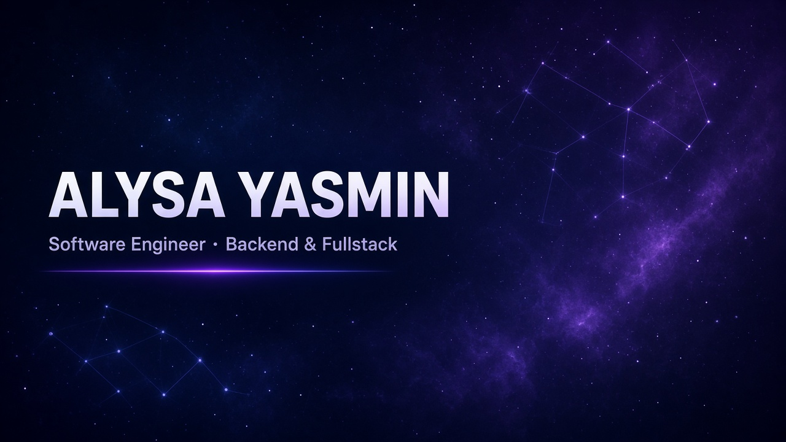

<!--
  Profile README — ganti teks bertanda [EDIT].
  Repo ini harus public. Agar tampil di profil GitHub,
  rename repo menjadi persis: alysayasmin (bukan alysayasmin-alysayasmin).
-->

  

<h1 align="center">Hi, I'm Alysa Yasmin</h1>

<strong>Software Engineer</strong> · Backend &amp; Fullstack

  Jakarta, Indonesia ·
  <a href="mailto:hello@example.com">hello@example.com</a>

---

### About me

Final-year / junior software engineer focused on backend APIs and product features that stay testable. I like clean architecture, typed contracts, and shipping with a team.

Currently learning production-ready APIs with TypeScript, PostgreSQL, and realtime systems. Goal: write reliable software and grow as an engineer who can own a system end to end.

<!-- [EDIT] ganti paragraf di atas -->

---

### Connect

  
  
  

---

### Tech stack

Stack yang sudah dipakai di project (Dolan & belajar):

  
  
  
  
  
  
  
  
  
  
  
  
  
  

---

### GitHub stats

  
  

  

---

Thanks for visiting. Replace the dummy name, email, and LinkedIn when you are ready.

