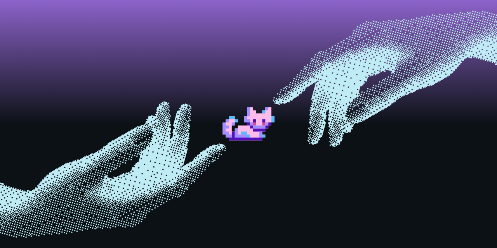

<!--
  Profile README — ganti teks dummy (email, LinkedIn, About).
  Repo public bernama alysayasmin → tampil di https://github.com/alysayasmin
-->

  

<h1 align="center">Hi 👋🏻, I'm Fitria Alysa Yasmin</h1>

<strong>Software Engineer</strong> · Backend &amp; Fullstack · UI/UX Designer

  Jakarta, Indonesia ·
  <a href="mailto:alysayasmin1505@gmail.com">alysayasmin1505@gmail.com</a>

---

### 🤝 Connect

  
  
  

---

### 💻 Tech stack

**Languages**

  
  
  
  
  
  

**Frontend**

  
  
  
  
  
  
  
  
  

**Backend & data**

  
  
  
  
  
  
  
  

**AI, maps & media**

  
  
  
  
  
  

**Testing & docs**

  
  
  
  

**DevOps & hosting**

  
  
  
  
  
  

**PWA**

  
  
  
  
  

**Design**

  
  
  
  
  

**Hardware & tools**

  
  
  
  
  
  

---

### GitHub stats

  

---

Thanks for visiting my GitHub profile!, I hope you find my work interesting.

